# Advanced Data Flows

StepWright provides built-in File I/O operations directly inside the step flow, eliminating the need to write custom Python file handling logic around your browser automation. Let's explore how `readData` and `writeData` let you treat your scraping process like a data pipeline. 

```mermaid
graph LR
    A[(data.csv)] -->|readData| B(Collector List)
    B -->|foreach| C[Browser Actions]
    C -->|Extract| D(Results Array)
    D -->|writeData| E[(output.json)]
    
    classDef file fill:#2e3842,stroke:#3eaf7c,stroke-width:2px;
    class A,E file;
```



## Supported Formats

StepWright provides native handlers for:
- JSON (`.json`)
- CSV (`.csv`)
- Excel (`.xlsx` - requires `openpyxl` dependency)
- Plain Text (`.txt`)
- Custom Formats (via Callbacks)

## `readData` 
Load data into the collector array. This is perfect for feeding URLs or Keywords from a file directly into a `foreach` loop.

```python
BaseStep(
    id="load_file",
    action="readData",
    value="keywords.csv",   # File Path
    data_type="csv",        # Expected Format
    key="queue"             # Store the result array in the collector under this key
)
```

## `foreach` (External Lists)
Once data is placed in the collector via `readData`, you can iterate over it natively using a `foreach` loop. Use `{{key}}` syntax in the Loop's `value`.
```python
BaseStep(
    id="loop",
    action="foreach",
    value="{{queue}}", # Matches the key from readData above 
    subSteps=[
        BaseStep(id="nav", action="navigate", value="https://example.com/search?q={{item}}"),
        BaseStep(id="extract", action="data", object=".name", key="name")
    ], 
    key="results"
)
```

## `writeData`
Save your heavily structured output directly back to disk. Use the `key` to identify exactly which piece of the collector gets exported. 
```python
BaseStep(
    id="save",
    action="writeData",
    value="results.json",
    data_type="json",
    key="results"  # The key where 'foreach' deposited the data
)
```

## 🛠️ Custom Callbacks (Advanced)
Need to parse an XML file or interact with a proprietary API? Provide your own Python logic using a custom callback.

```python
def my_custom_reader(path, step):
    import xml.etree.ElementTree as ET
    tree = ET.parse(path)
    # Must return a List or Dict
    return [el.text for el in tree.findall('.//item')]

# Pass the function directly into the BaseStep
step = BaseStep(
    id="load-xml",
    action="readData",
    value="data.xml",
    data_type="custom",
    callback=my_custom_reader,
    key="items"
)
```
