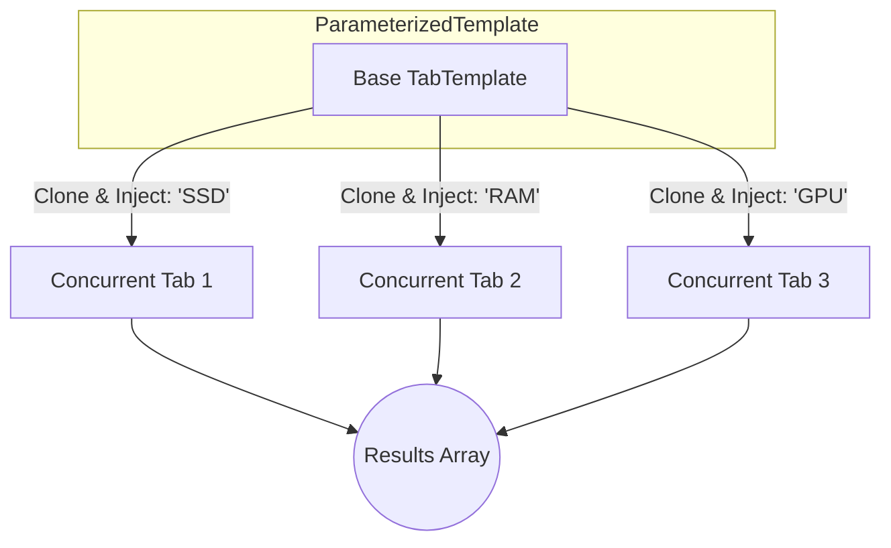

# Parallelism & Concurrency

StepWright allows you to run multiple templates concurrently to significantly speed up your scraping tasks. This is achieved using Python's `asyncio.gather` under the hood, but abstracted into easy-to-use dataclasses.

## ⚡ `ParallelTemplate`
Run completely different scraping workflows at the same time across multiple browser pages.

```python
import asyncio
from stepwright import run_scraper, TabTemplate, BaseStep, ParallelTemplate

async def main():
    # Define Template 1
    t1 = TabTemplate(
        tab="search-electronics",
        steps=[
            BaseStep(id="nav", action="navigate", value="https://example.com/electronics"),
            BaseStep(id="extract", action="data", object="h1", key="title")
        ]
    )

    # Define Template 2
    t2 = TabTemplate(
        tab="search-books",
        steps=[
            BaseStep(id="nav", action="navigate", value="https://example.com/books"),
            BaseStep(id="extract", action="data", object="h1", key="title")
        ]
    )

    # Group them to run concurrently
    batch = ParallelTemplate(templates=[t1, t2])

    results = await run_scraper([batch])
    print(f"Collected total: {len(results)} items")

if __name__ == "__main__":
    asyncio.run(main())
```

## 🚀 `ParameterizedTemplate`



Scaling up is trivial with `ParameterizedTemplate`. Pass a single base template and a list of values (e.g., keywords or URLs). StepWright will clone the template, inject the value into your placeholders (`{{keyword}}`), and run them all concurrently.

```python
import asyncio
from stepwright import run_scraper, TabTemplate, BaseStep, ParameterizedTemplate

async def main():
    search_tmpl = TabTemplate(
        tab="search_{{term}}",
        steps=[
            # {{term}} is dynamically replaced
            BaseStep(id="nav", action="navigate", value="https://example.com/search?q={{term}}"),
            BaseStep(id="price", action="data", object=".item-price", key="price")
        ]
    )

    # Search for exactly 4 items at the SAME time!
    task = ParameterizedTemplate(
        template=search_tmpl,
        parameter_key="term",
        values=["SSD", "RAM", "GPU", "CPU"]
    )

    results = await run_scraper([task])
    
if __name__ == "__main__":
    asyncio.run(main())
```

> **Note:** Concurrent execution is highly dependent on your machine's resources and the target website's rate limits. Opening too many headless browsers simultaneously may cause Out-Of-Memory errors or IP blocks.
